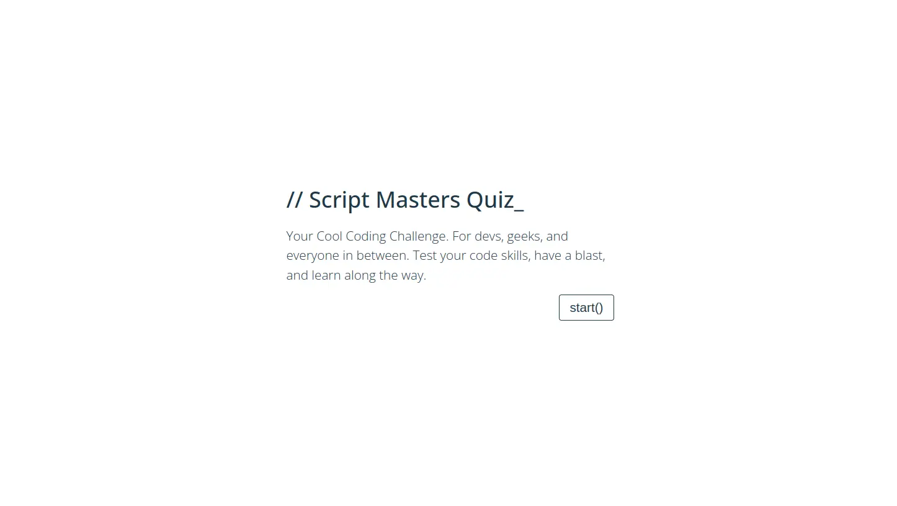

# Quiz ❓

▷ Building this quiz web app is like jet fuel for my developer journey. It's a hands-on gig that's firing up my growth engine. I'm diving into HTML, CSS, and JavaScript while crafting this interactive knowledge assessment playground. It's not just honing my problem-solving chops; it's also diving into the booming world of interactive learning. With its versatility, market appeal, and cash-making potential through ads or subscriptions, this project isn't just a personal growth path; it's a promising business venture! 💡💰


## Contents 📜

[Planning & Development](https://github.com/mistersouza/quiz#planning--development)

[Features](https://github.com/mistersouza/quiz#features)

[Testing](https://github.com/mistersouza/quiz#testing)

[Deployment](https://github.com/mistersouza/quiz#deployment)

[Languages](https://github.com/mistersouza/quiz#languages)

[Software](https://github.com/mistersouza/quiz#software)

[Media](https://github.com/mistersouza/quiz/README.md#media)

[Credits](https://github.com/mistersouza/quiz/README.md#credits)

## Planning & Development

### Business Strategy

● Of course, here are three essential components of business strategy for the web app development:

+ __User-Centric Design:__ Place a strong emphasis on creating an intuitive and engaging user interface that guarantees an enjoyable experience for quiz participants.

+ __Quality and Engaging Content:__ Build a relevant and engaging content repository that caters to a our audience demographic.

+ __Monetization and Marketing:__ Diversify income through premium quizzes, ads, and freemium models. Utilize social media, SEO, and collaborations to grow the user base and secure sponsorships.

### Audience 🎯

● The initial target audience for the quiz web-app would include:_

1. <details><summary>Students and Educators</summary> Educational quizzes can cater to students of various age groups, helping with learning and test preparation.</details>

2. <details><summary>Trivia Enthusiasts</summary> Users with an interest in the history of motorsport and iconic racing figures like Ayrton Senna.</details>

3. <details><summary>Brands and Marketers</summary> Businesses interested in using quizzes for marketing and engagement with their audience.</details>

4. <details><summary>Event Organizers</summary> Those organizing events or team-building activities that require interactive quizzes.</details>

5. <details><summary>Online Communities</summary> Forum or social media communities that enjoy sharing and participating in quizzes.</details>

6. <details><summary>Content Creators</summary> Bloggers and content creators who wish to engage their audience through interactive quizzes.</details>

7. <details><summary>Professional Development</summary> Individuals looking for self-assessment or skill development quizzes for career advancement.</details>

### User Stories

● These user stories support the website's business strategy, ensuring an engaging and valuable experience for all target audiences.

+ __Student:__ As user,  want access to a wide range of educational quizzes to help me prepare for exams and improve my knowledge. I'm willing to pay for premium quiz packs with in-depth content to enhance my learning experience.
+ __Brand Marketer:__ As user, I aim to boost brand visibility and engage my audience through integrated interactive quizzes, and I'm open to investing in sponsored quiz content.
+ __Event Organizer:__ As user, I need a user-friendly quiz platform for events and team building, and I'm ready to subscribe to a premium plan with customization and analytics.
+ __Online Community Moderator,:__ As user, I want to keep my community engaged with entertaining quizzes related to our niche. I'm interested in partnerships that allow me to monetize our community's interaction and shared content.
+ __Content Creator:__ As user, I want to use quizzes to drive audience engagement on my blog or website. I'm open to advertising and affiliate opportunities to generate income while enhancing user interaction with my content.

### Objectives

● These succinct objectives outline the web-app's core purposes and strategic focus.

1. <details><summary>User-Centric Design</summary>Prioritize user experience by creating a user-friendly, responsive, and intuitive interface.</details>

2. <details><summary>Community Building</summary>Foster online communities by providing quiz content that encourages interaction and sharing.</details>

3. <details><summary>Educational Enrichment</summary>Provide a platform for users to access and create educational quizzes to enhance learning.</details>

4. <details><summary>Entertainment and Engagement</summary>Create interactive and fun quizzes to engage and entertain a broad audience.</details>

5. <details><summary>Content Diversity</summary>Regularly update and diversify quiz content to maintain user engagement and interest.</details>

6. <details><summary>Marketing and Brand Promotion</summary>Enable brands to utilize quizzes for marketing, driving brand recognition and customer engagement.</details>

7. ### Approach

● The approach ensures synergy with both business strategies and user expectations, emphasizing a smooth and user-focused journey

+ Organize information logically through thorough research and planning.
+ Craft the website with a focus on user experience principles.
+ Uphold straightforward navigation, intuitive design, and design coherence.
+ Guarantee that the website's content remains inclusive and non-offensive for all users.
+ Integrate a user-friendly subscription mechanism for users to join a mailing list.

### Wireframe

● We've gone with Balsamiq software for those slick and responsive designs. These wireframes help us nail down the website's structure and content layout.


### Color Scheme

● In our initial design phase, we're sticking with grayscale for that classic, user-centric feel. Still, we've added a hint of red and green to highlight essential features. Other accent colors will make their grand entrance after we've done some deep diving into UX research to really make the design pop.


### Typography

● We're rocking a single font for that clean and unified design. But watch out – we're eyeing some custom fonts for a bold move. We're diving into UX research, fine-tuning our goals, and teaming up. Our mission? Amp up the site's coolness and user vibes with fonts that click with our style and user tastes.

    ● Lato
        ○ Thin ○ Light ○ Italic ○ Regular ○ SemiBold ○ Bold


## Features

● Take a peek at what our app can do now and the exciting stuff we've got cooking

### Home

● Sleek and mobile-friendly, it's all about that minimalistic vibe. It smoothly eases users into the quiz and guides them to the next screen without a hitch.



### Guide

● It's again about minimalism, making friends with both small and large screens. It educates users on the game and lets them make the call 


### Quiz

● I've packed it with plenty of features. Users receive feedback for right and wrong answers, keep an eye on their scores and progress. Users can only click the right button at the right moment, and they're continuously informed about their actions and performance.


### Results

● Users are in for a treat when they see their performance, and it looks great on any screen. With a clean and interactive progress bar, they can easily gauge their quiz journey. And guess what? They get the chance to go at it again or call it a day.


## Testing 🔎

● Testing at every stage of development, keeping it on point.

### Assessment

+ We've been rocking Google DevTools to check how our site dances in real-time, making sure it grooves smoothly on various devices browsers and connection speeds. Tho, no automatic test is in place right now, we've got every click and swipe covered to ensure it's all smooth sailing.

### Validation

+ We've gone through every line of code with a fine-tooth comb, and guess what? The W3C validators gave us a thumbs-up across the board.


### Performance

+ I've got a thing for those numbers that light up in vibrant green.
  


### Bug Fixes

+ I've learned a lot by conquering those pesky logical bugs in this project. Some were straightforward, while others... not so much. I've grown to appreciate them, almost like I would a stern teacher.

It took a bit of tinkering to rearrange loadQuestion and get those questions in the right order.

```javascript
next.addEventListener('click', () => {
    if (question < 5) {
        loadQuestions(question);
        document.querySelector('.quiz__footer--count').innerHTML = ++question;
    } else {
        showResults();
    }
    next.classList.add('disabled');
});
```

This one definitely added a few more gray hairs! I couldn't quite pinpoint why the event kept bubbling up to the parent.

```javascript
const options = document.querySelectorAll('.quiz__option');

options.forEach(option => {
    option.addEventListener('click', function(event) {
        event.stopPropagation();
        console.log('clicked');
    });
});
```

I ended up adding a click event to every element that houses the quiz options.

```javascript
document.querySelectorAll('.quiz__option').forEach(option => {
        option.setAttribute('onclick', 'checkAnswer(this)');
        if (option.getAttribute('data-option') === questions[index].correct) {
            option.classList.add('quiz__option--correct');
        }
});
```

### Unfixed Bugs

+ "You give me the word, and I'll be on a mission to terminate it first thing tomorrow morning." 👊

## Deployment 🚀

● We pushed the app live [here](https://mistersouza.github.io/quiz/)

+ See how we rocked it with [GitHub Pages](https://youtu.be/DqjPr7auwdY?si=CMQMCvASxNmIDD3e)

## Tech 🛠️

### Languages

_Web trinity

+ HTML
+ CSS
+ JS

### Software

_Toolkit

+ VS Code, coding
+ Balsamiq, designing
+ Git, version controlling
+ GitHub, sharing, deploying, and other cool stuff

## Credits

● Sure, I've been the sole architect handling the planning, design, and code, but I couldn't have made it happen without a few trusty allies. And to be honest, I wouldn't have it any other way. The teamwork and camaraderie in the world of programming are some of the things I value most on this journey

### Inspired by

+ This project has given me the boost I needed to get up and running.
  + Code Institute's [Love maths](https://github.com/mistersouza/love-maths.git)

+ I took a sip from this well of inspiration. It's been truly motivating. And I've got to give props to a whole bunch of CSS I borrowed for the results section.
  + Codehal's [How To Make Quiz Website Using HTML CSS And Javascript](https://youtu.be/Vp8x8-reqZA?si=fjsM0DHVDRsKvYxq)

### Thanks

+ David Calikes, Code Institute Cohort Facilitator.
  + Positive and Uplifting. David's Always available and boosts my confidence time we chat.
+ Oluwafemi Medale, Code Institute Mentor.
  + Bugs terminator. He always make times, when there's no time at all.
+ Chat GPT, Mister know it all.
  + Documenting King. Not always correct, but frequently inspiring.
